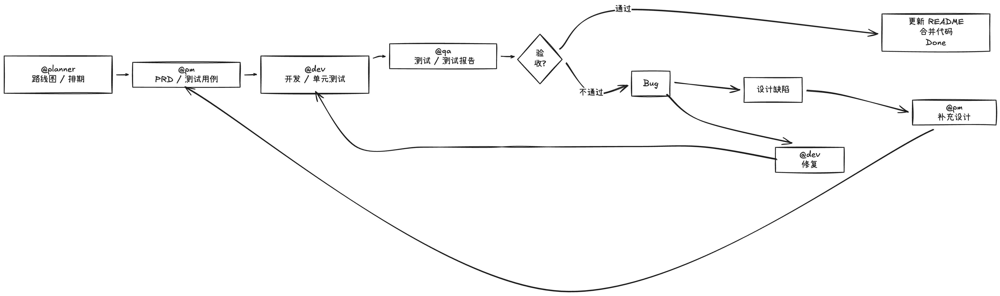

# Dev Workflow Skill

> 面向小团队的 AI 协作工作流 Skill：通过 `@planner`、`@pm`、`@dev`、`@qa` 把需求、设计、开发、测试串成可追踪闭环，降低返工并沉淀团队资产。

相比“想到哪做到哪”的 AI 协作方式，这套 Skill 更强调 **可交接、可追踪、可复盘**：

- 需求有来源（排期或明确输入）
- 设计有文档（PRD 与测试用例）
- 开发有依据（按文档实现与修复）
- 测试有结论（Bug 与设计缺陷分流）
- 验收有沉淀（README 与分支合并）

## 核心能力

- **四角色分工**：Planner（规划）、PM（设计）、Dev（研发）、QA（测试）
- **Git Worktree 隔离**：develop、test 分支独立工作目录，互不干扰
- **状态自动流转**：planning → developing → testing → reviewing → done
- **Bug 修复闭环**：测试发现 Bug → 开发修复 → 重新测试
- **设计缺陷反馈**：测试发现设计问题 → PM 补充设计 → 开发实现 → 重新测试
- **自动化验收**：测试通过后更新 README，合并代码到主分支

## 适用场景

| 场景 | 常见问题 | 推荐触发方式 | 直接价值 |
|------|----------|--------------|----------|
| 新功能迭代（1~2 周） | 需求和实现经常对不齐 | `@planner` → `@pm` → `@dev` → `@qa` | 让“需求-实现-验收”链路可追踪 |
| 小团队并行协作 | 开发与测试互相干扰 | Worktree + `develop/test` 分支 | 降低分支冲突与环境污染 |
| 频繁改需求项目 | 测试提的问题没人归档 | `@qa` 产出报告，分流到 `@dev`/`@pm` | 减少口头沟通损耗，提升修复效率 |
| 需要对外/对上汇报 | 过程不可见，复盘困难 | 文档自动沉淀到 `docs/` | 形成可复用的团队资产 |

## 使用价值

- **降低沟通成本**：统一用 PRD、测试用例、测试报告做跨角色“共同语言”。
- **减少返工概率**：先设计后开发，测试把“代码问题”和“设计问题”分开处理。
- **提升交付稳定性**：通过状态机约束流程，避免跳步导致的遗漏。
- **沉淀团队方法论**：每次迭代都会留下结构化文档，便于 onboarding 与复盘。
- **兼容现有 Git 流程**：无需重构仓库，只需增加 `develop/test` worktree 即可接入。

## 工作流程



> 将你准备的 PNG 文件放到 `assets/dev-workflow.png`（或按实际文件名修改上面的路径）即可展示流程图。

## 四个 Skill

| Skill | 触发词 | 职责 | 输出 |
|-------|--------|------|------|
| **planner** | `@planner`, `规划` | 产品路线图、迭代排期 | `docs/roadmap.md`, `docs/sprint-plan.md` |
| **pm** | `@pm`, `新需求`, `补充设计` | PRD设计、测试用例、设计补充 | `docs/prd/*.md`, `docs/test-cases/*.md` |
| **dev** | `@dev`, `修复` | 代码开发、单元测试、Bug修复 | 代码实现 |
| **qa** | `@qa`, `重测` | 集成测试、测试报告、验收引导 | `docs/test-reports/*.md` |

## 安装

### 方式一：复制到全局目录（推荐）

```bash
# 克隆仓库
git clone https://github.com/your-username/dev-workflow-skill.git
cd dev-workflow-skill

# 复制 skill 文件夹到 Claude Code 全局目录
cp -r skills/planner ~/.claude/skills/
cp -r skills/pm ~/.claude/skills/
cp -r skills/dev ~/.claude/skills/
cp -r skills/qa ~/.claude/skills/
```

### 方式二：项目级安装

将 `skills/` 目录复制到你的项目中：

```bash
cp -r skills/ your-project/.claude/skills/
```

## 使用指南

### Step 1: 配置目标项目

将 `CLAUDE.md` 复制到你的项目根目录：

```bash
cp CLAUDE.md your-project/
```

### Step 2: 初始化文档目录

```bash
cd your-project
mkdir -p docs/prd docs/test-cases docs/test-reports
```

### Step 3: 初始化 Git Worktree

```bash
# 自动检测主分支（main 或 master）
DEFAULT_BRANCH=$(git branch --show-current)

# 创建 develop 和 test 分支
git branch develop $DEFAULT_BRANCH 2>/dev/null || true
git branch test $DEFAULT_BRANCH 2>/dev/null || true

# 创建 worktree（独立工作目录）
git worktree add ../$(basename $(pwd))-develop develop
git worktree add ../$(basename $(pwd))-test test
```

### Step 4: 开始工作流

```bash
# 1. 产品规划：制定路线图和迭代排期
@planner

# 2. 产品设计：根据排期生成 PRD 和测试用例
@pm

# 3. 研发开发：实现功能代码
@dev

# 4. 测试验证：执行测试并生成报告
@qa

# 5. 验收通过后自动合并代码
验收通过
```

## 典型使用场景（含价值）

### 场景一：新功能开发

**适用时机**：需求已明确，希望尽快进入设计与实现。  
**价值**：减少“边做边改”造成的返工，快速形成可测试交付物。

```bash
# 直接描述需求，跳过规划阶段
@pm 新需求：实现用户登录功能，支持邮箱和手机号登录

# PM 生成 PRD 和测试用例后
@dev

# 开发完成后
@qa

# 测试通过，用户验收
验收通过
```

### 场景二：Bug 修复

**适用时机**：测试报告已给出 Bug 列表，需要开发快速回归修复。  
**价值**：基于报告逐项修复，避免遗漏和重复沟通。

```bash
# 测试发现 Bug 后，查看测试报告
@dev 修复

# 修复完成后重新测试
@qa 重测
```

### 场景三：设计缺陷补充

**适用时机**：测试发现问题不属于代码缺陷，而是需求覆盖不足。  
**价值**：把“设计补充”前置为独立步骤，避免开发在错误目标上持续投入。

```bash
# 测试发现设计缺陷（PRD 未覆盖的场景）
@pm 补充设计

# PM 补充 PRD 后，开发实现
@dev

# 重新测试
@qa 重测
```

### 场景四：完整迭代流程

**适用时机**：从规划到上线都希望走一套标准流程。  
**价值**：完整保留每个阶段产物，方便验收、复盘和团队复制。

```bash
# 1. 规划本迭代要做的功能
@planner

# 2. 选择排期中的需求进行设计
@pm

# 3. 开发
@dev

# 4. 测试
@qa

# 5. 如有问题，循环修复
@dev 修复  # Bug
@pm 补充设计  # 设计缺陷

# 6. 验收上线
验收通过
```

## 状态流转

工作流状态保存在 `.workflow-status.json` 文件中：

```
planning → developing → testing → reviewing → done
               ↑            │
               └── fixing ──┘
                     │
               ↑     │
               └─────┘ (设计缺陷补充)
```

| 状态 | 说明 | 下一步 |
|------|------|--------|
| `planning` | PRD 设计中 | `@dev` 开始开发 |
| `developing` | 开发中 | `@qa` 开始测试 |
| `testing` | 测试中 | 验收 或 `@dev 修复` |
| `reviewing` | 待验收 | `验收通过` |
| `done` | 已完成 | - |

## 项目结构

```
dev-workflow-skill/
├── README.md                 # 本文档
├── CLAUDE.md                 # 项目规则（复制到目标项目）
├── .gitignore
└── skills/
    ├── planner/
    │   └── SKILL.md          # 产品规划 Skill
    ├── pm/
    │   └── SKILL.md          # 产品设计 Skill
    ├── dev/
    │   └── SKILL.md          # 研发经理 Skill
    └── qa/
        └── SKILL.md          # 测试经理 Skill
```

## Git 分支策略

| 分支 | 用途 | Worktree 目录 |
|------|------|---------------|
| `main`/`master` | 生产代码 | `project/` |
| `develop` | 开发分支 | `project-develop/` |
| `test` | 测试分支 | `project-test/` |

## 测试报告说明

测试报告包含以下关键信息：

- **测试结果汇总**：通过率、失败用例
- **Bug 列表**：代码层面的问题，需 `@dev 修复`
- **设计缺陷列表**：PRD 层面的问题，需 `@pm 补充设计`
- **验收使用说明**：环境配置、必填项、操作步骤

## FAQ

### Q: main 和 master 分支如何兼容？

所有 Skill 都会自动检测主分支名称：

```bash
DEFAULT_BRANCH=$(git branch | grep -E '^\*?\s*(main|master)$' | head -1 | tr -d '* ')
```

### Q: 如何跳过规划阶段？

直接使用 `@pm 新需求：xxx` 描述需求即可。

### Q: Bug 和设计缺陷有什么区别？

- **Bug**：代码未按 PRD 实现，或程序错误 → `@dev 修复`
- **设计缺陷**：PRD 未覆盖的场景，或交互不合理 → `@pm 补充设计`

### Q: 验收通过后会做什么？

1. 更新 README.md（面向 GitHub 用户的使用说明）
2. 提交更新
3. 合并 test 分支到 main/master
4. 更新状态为 done

## License

MIT
